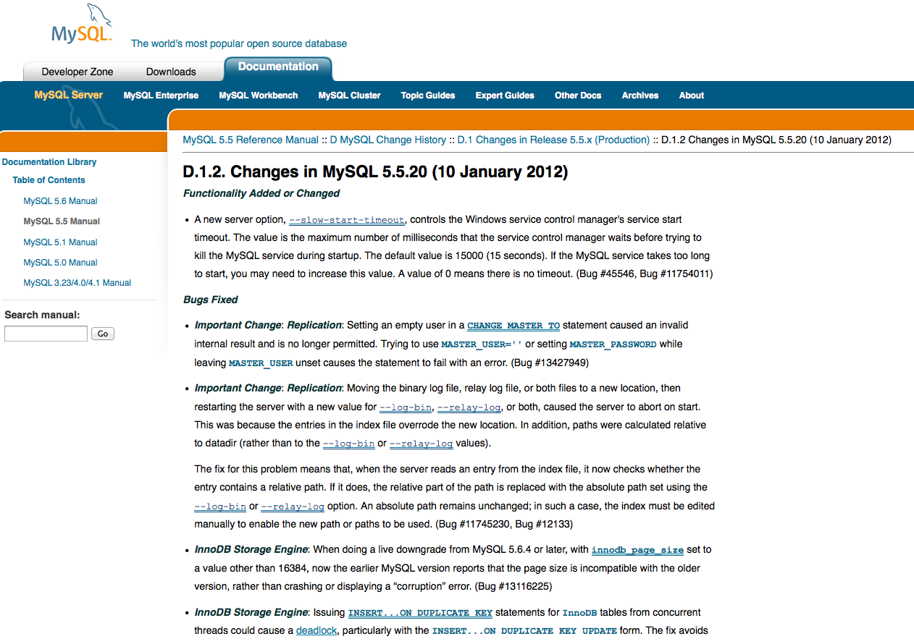
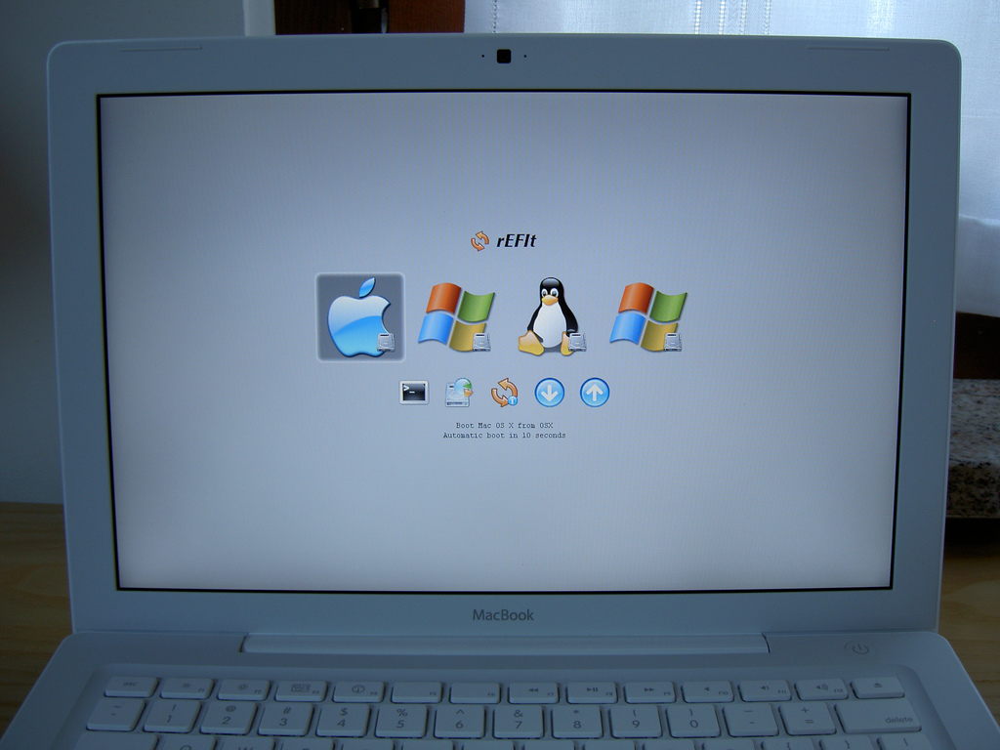

!SLIDE impact
# 用 Vagrant 快速 建立開發環境 #

## Francis Chong ##

!SLIDE
# 開發網路軟件 #

!SLIDE impact

# 問題 #

!SLIDE

# 複雜的開發環境 #

!SLIDE full-page-image

[Stack o' Mac by tdhedengren, on Flickr](http://www.flickr.com/photos/tdhedengren/5138982641/)

# 設定需時 #

!SLIDE
# 版本差異 #

!SLIDE

# 在工作機上運行所有 Server？！#

!SLIDE full-page-image

[Quad boot Macbook by foskarulla, on Flickr](http://www.flickr.com/photos/foskarulla/2310220114/)

# 作業系統問題 #

!SLIDE full-page-image mi

# MISSION IMPOSSIBLE #

!SLIDE impact

# 解決方法？ #

!SLIDE
## Virtualization ##

!SLIDE full-screen-image

# Vagrant #

!SLIDE

# 甚麼是 Vagrant ？ #

!SLIDE

## 一套建立和管理虛擬機的軟件 ##

