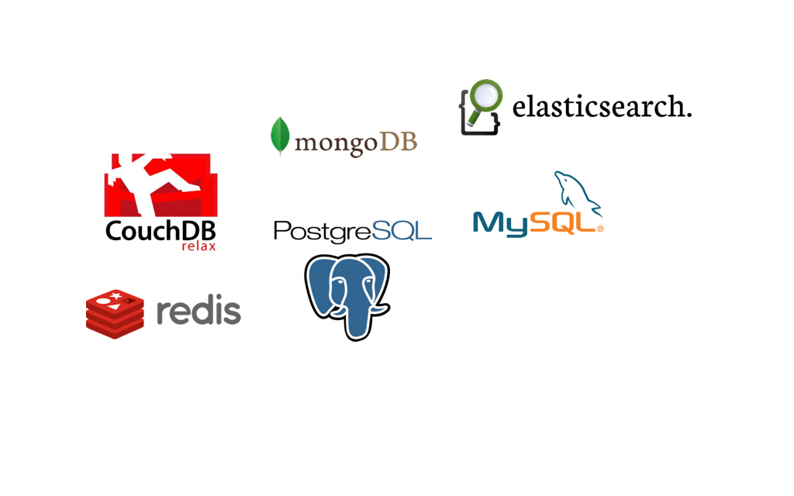

!SLIDE opening
# 用 Vagrant 快速 建立開發環境 #

## Francis Chong ##

!SLIDE
# 開發網路軟件 #

!SLIDE

# 問題 #

!SLIDE

# 複雜的開發環境 #

.caption [Quad boot Macbook by foskarulla, on Flickr](http://www.flickr.com/photos/foskarulla/231022011)

!SLIDE

## 設定需時 ##

.caption [Stack o' Mac by tdhedengren, on Flickr](http://www.flickr.com/photos/tdhedengren/5138982641/)

!SLIDE

## 版本差異 ##

!SLIDE

## 要在工作機上運行所有 Server 嗎？##

!SLIDE
## 作業系統問題 ##

!SLIDE full-page-image

# Mission Impossible #

!SLIDE

# 解決方法？ #

!SLIDE
## Virtualization ##

!SLIDE full-screen-image

# Vagrant #

!SLIDE

# 甚麼是 Vagrant ？ #

!SLIDE

## 一套建立和管理虛擬機的軟件 ##

