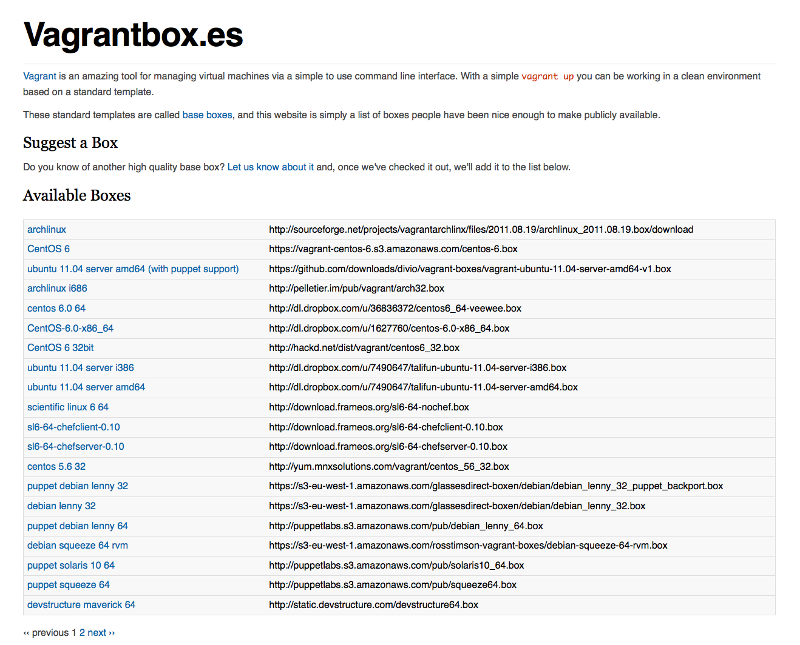
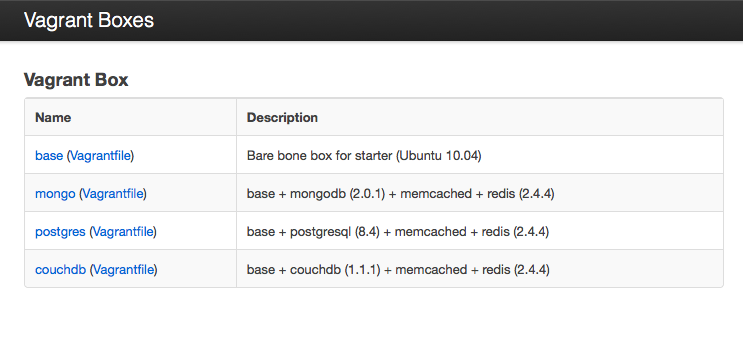

!SLIDE
## 安裝和執行 ##

    @@@ sh
    gem install vagrant
    vagrant box add lucid32 http://.../lucid32.box
    vagrant init lucid32

!SLIDE
## 登入 ssh ##
    @@@ sh
    vagrant up
    vagrant ssh
    cd /vagrant
    sudo apt-get install ...

!SLIDE
## 設定檔 ##

    $ ls
    Vagrantfile

!SLIDE
## 基本設定 ##

    @@@ ruby
    Vagrant::Config.run do |config|
      config.vm.box = "lucid32"
      config.vm.box_url = "http://.../lucid32.box"
    end

!SLIDE
## 自訂 box ##
    @@@ruby
    Vagrant::Config.run do |config|
      config.vm.provision :shell, 
        :inline => "echo foo > /vagrant/test"
    end

!SLIDE
## Port Forwarding ##

    @@@ ruby
    Vagrant::Config.run do |config|
      config.vm.forward_port "rails", 3000, 3000
      config.vm.forward_port "mongo", 27017, 27017
      config.vm.forward_port "mongo-http", 28017, 28017
      config.vm.forward_port "redis", 6379, 6379  
      config.vm.forward_port "memcached", 11211, 11211
    end

!SLIDE
## 共用資料夾 ##

    @@@ ruby
    Vagrant::Config.run do |config|
      config.vm.share_folder "v-root", "/vagrant", "."
    end

!SLIDE

## 控制多個 VM ##

    @@@ ruby
    Vagrant::Config.run do |config|
      config.vm.define :web do |web_config|
        web_config.vm.network "33.33.33.10"
        web_config.vm.box = "web"
      end      

      config.vm.define :db do |db_config|
        db_config.vm.network "33.33.33.11"
        db_config.vm.box = "mongo"
      end
    end

!SLIDE
## 包裝自己的 Vagrant Box ##

    $ vagrant package  
    package.box

!SLIDE full-screen-image

!SLIDE full-screen-image

## 自家的 Box Server  ##

!SLIDE

## 作業流程 (1) ##

    @@@ sh
    git add Vagrantfile
    git commit -m "add vagrant file"
    git push origin master

!SLIDE

## 作業流程 (2) ##

    @@@ sh
    git pull
    vagrant up
    vagrant ssh
    cd /vagrant
    rails s

!SLIDE 
.huge 立即可用

!SLIDE
.huge 完全一樣
的    
開發環境

!SLIDE
# [vagrantup.com](http://vagrantup.com/) #

!SLIDE
# Contact #

- [twitter.com/siuying](http://twitter.com/siuying)
- [ruby-hk.org](http://ruby-hk.org)
