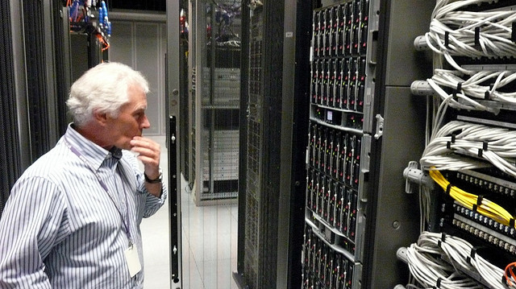
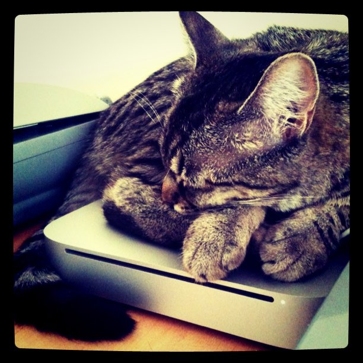
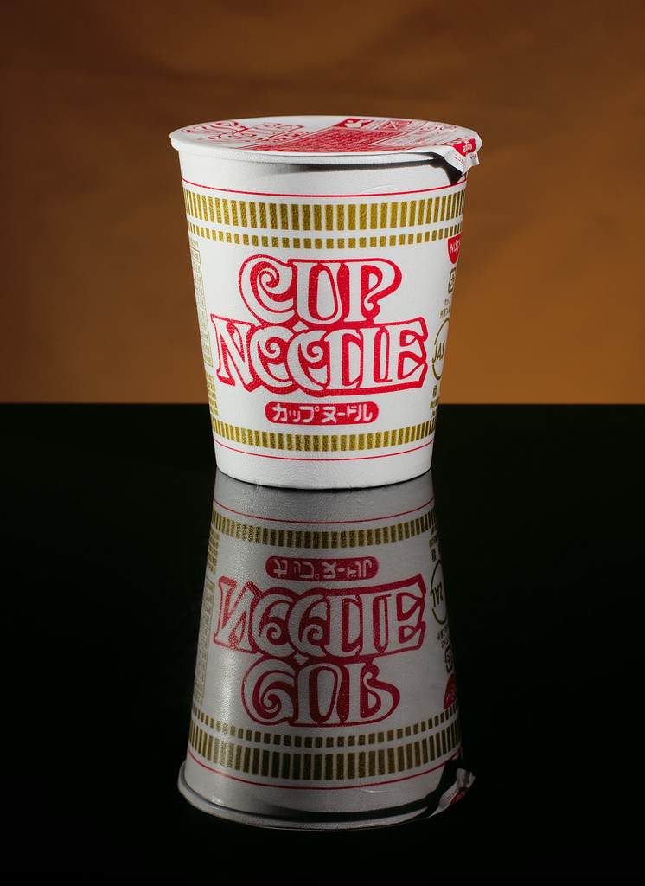
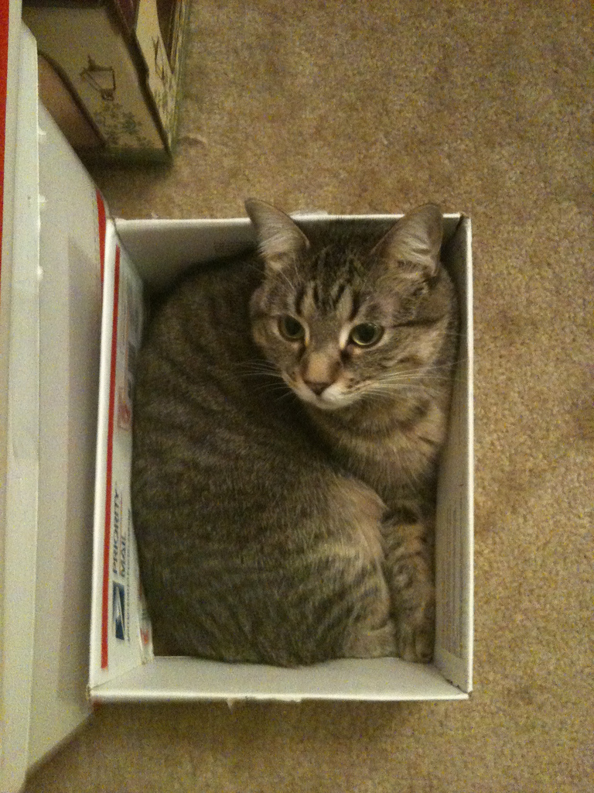

!SLIDE center
.huge Conclusion

!SLIDE full-page-image

## Need no sysadmin ##
[Awesome data-center porn, Wellcome-Sanger, Cambridge, UK 4.JPG by gruntzooki, on Flickr](http://www.flickr.com/photos/doctorow/2698336843/)

!SLIDE full-page-image

## Simple  ##
[amy is an applecat by hessiebell, on Flickr](http://www.flickr.com/photos/hessiebell/5565852914/)

!SLIDE full-page-image

## Ready to Serve ##
[Cup Noodle by JanneM, on Flickr](http://www.flickr.com/photos/jannem/2357395211/)

!SLIDE full-page-image

## Consistent Environment ##
[Stormy Parade by leg0fenris, on Flickr](http://www.flickr.com/photos/legofenris/4039682937/)

!SLIDE full-page-image

## Isolation ##
[box cat by dreamattack, on Flickr](http://www.flickr.com/photos/dreamattack/6797716413/)

!SLIDE center
# [vagrantup.com](http://vagrantup.com/) #

!SLIDE center
.huge Whats Next?

!SLIDE
# Automation #

- VeeWee
- Chef/Puppet
- Vagrantfile

!SLIDE center
# Versioning #

!SLIDE
.huge Executable Boxes: [wanton](https://github.com/maestrodev/wanton)

Publisable Java jar, with build in Vagratn Box and web based interface.

!SLIDE
# Packaging #

    @@@ ruby
    rake

!SLIDE
# Running #

    @@@ ruby
    java -jar wanton.jar

!SLIDE center

.huge ~ the end ~

!SLIDE
# Contact #

- [twitter.com/siuying](http://twitter.com/siuying)
- [ruby-hk.org](http://ruby-hk.org)
